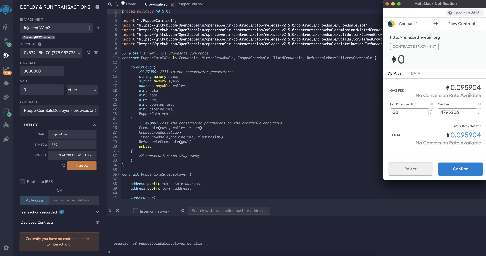
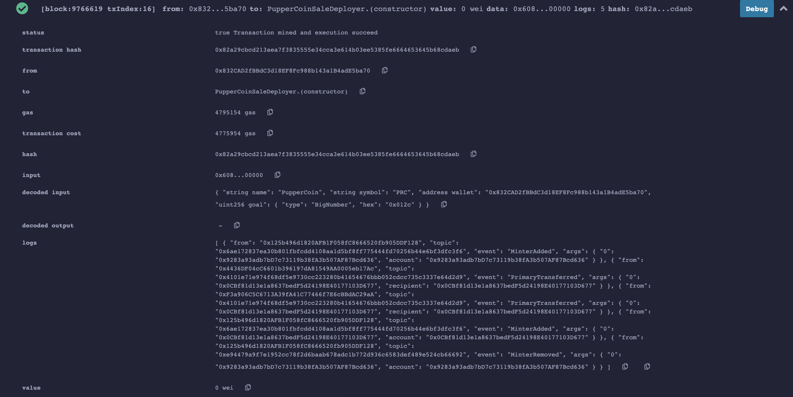
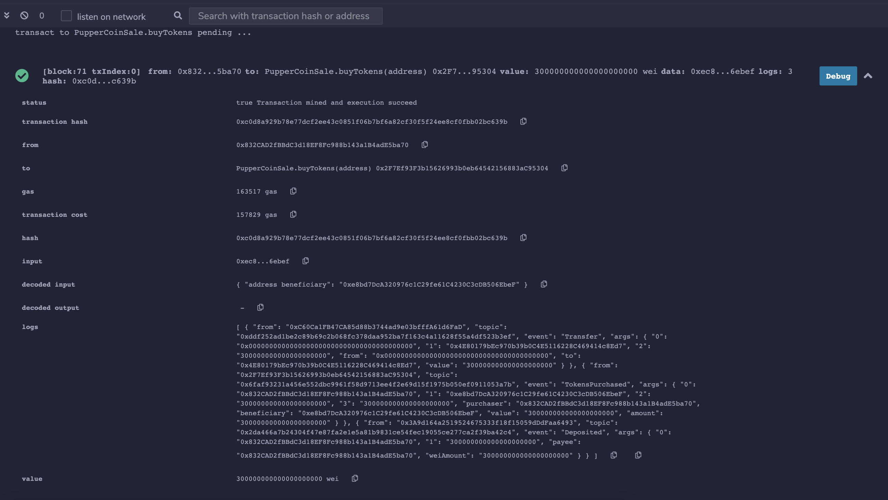

# Crowdsale Advanced Solidity

## Files

* [PupperCoin.sol](Contracts/PupperCoin.sol)
* [Crowdsale.sol](Contracts/Crowdsale.sol)
---

### To Note

* Before developing and testing the contracts, I have my blockchain network running in [Ganache](https://www.trufflesuite.com/ganache) and MetaMask extension connected and pointing to `Localhost:8545`.

* In the `Deploy` tab in [Remix IDE](http://remix.ethereum.org), I connected to my local Ganache chain by selecting `Injected Web3` in the `Environment` column.

* For each contract, I filled in the constructor parameters before transacting and deploying.

#### **ERC20 PupperCoin**

I used a standard `ERC20Mintable` and `ERC20Detailed` contract for the [PupperCoin.sol](Contracts/PupperCoin.sol).

#### **Crowdsale**

This contract raises Ethereum by issuing PupperCoin. One token (TKN) equals 1 ETH in order to maintain parity with Ether units and can be divided into TKNbits as Ether can be divided into wei. The goal is to raise 300 ETH with this crowdsale.

#### Gas Price Comparison for the transactions

Ropsten Gas Price

Local Network Gas Price
